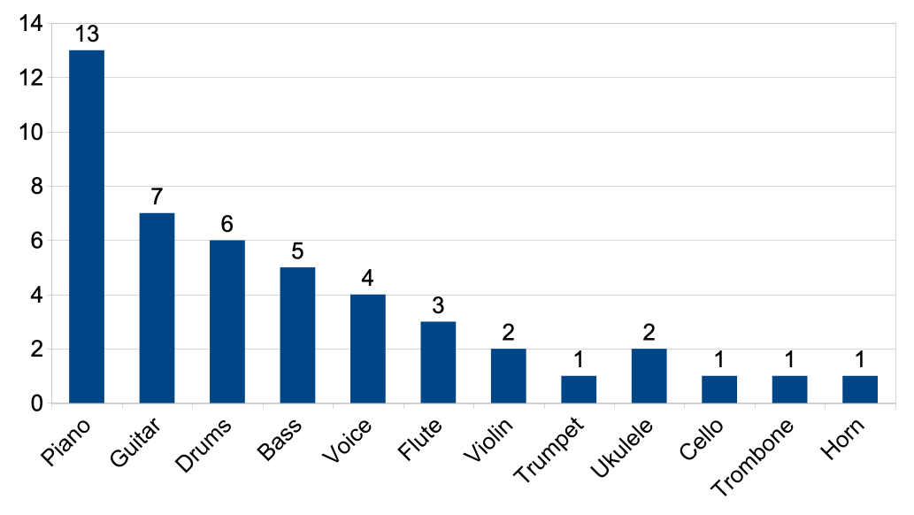
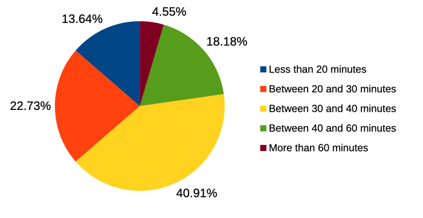

## 📑 Repository Index

* [Overview](#overview)
* [Repository Structure](#repository-structure)
* [Purpose of the Study](#purpose-of-the-study)
* [Evaluation Design](#evaluation-design)

  * [Participants](#participants)
  * [Study Structure](#study-structure)
  * [Device and Software Configuration](#device-and-software-configuration)
* [Task-Based Performance Results](#task-based-performance-results)

  * [Key Observations](#key-observations)
  * [Task Completion Summary](#task-completion-summary)
* [Questionnaire-Based Results](#questionnaire-based-results)

  * [Task Duration and Support](#task-duration-and-support)
* [Usability and Workload Metrics](#usability-and-workload-metrics)

  * [System Usability Scale (SUS)](#system-usability-scale-sus)
  * [NASA Task Load Index (NASA-TLX)](#nasa-task-load-index-nasa-tlx)
* [Discussion and Limitations](#discussion-and-limitations)

  * [Identified Challenges](#identified-challenges)
  * [Limitations](#limitations)
* [References](#references)
* [Acknowledgments](#acknowledgments)
* [Reproducibility](#reproducibility)
* [How to Cite](#how-to-cite)
* [License](#license)
* [Supplementary Materials](SUPPLEMENTARY.md)

---

## Overview

This repository contains the results of a **preliminary user evaluation** conducted for the **Hi-Audio online platform**, with a focus on its practical usability and applicability from the perspective of amateur musicians.

The study is directly linked to the following **journal publication**:
Gil Panal, J. M., David, A., & Richard, G. (2026). The Hi-Audio online platform for recording and distributing multi-track music datasets. *Journal on Audio, Speech, and Music Processing*. [https://doi.org/10.1186/s13636-026-00459-0](https://doi.org/10.1186/s13636-026-00459-0)

A preprint version is available at: [https://hal.science/hal-05153739](https://hal.science/hal-05153739)

Additional contextual information about the evaluation call and recruitment process is available here:
[https://hi-audio.imt.fr/agenda/user-evaluation-test/](https://hi-audio.imt.fr/agenda/user-evaluation-test/)

Individual **post-task questionnaire** responses (including usability and workload assessments) are available in the [`surveys/`](surveys/) folder of this repository.

The evaluation was conducted in collaboration with **La Scène**, the student music association of Télécom Paris:
[https://lascene.rezel.net/](https://lascene.rezel.net/)

---

## Repository Structure

```
hiaudio_user_evaluation_results/
├── README.md                                          # This file — study summary and results
├── SUPPLEMENTARY.md                                   # Participant-level data tables and qualitative feedback
├── DATA_DICTIONARY.md                                 # Column-level documentation for all data files
├── LICENSE                                            # Creative Commons Attribution 4.0 (CC BY 4.0)
├── validate.py                                        # Script to verify headline statistics from CSV files
├── docs/
│   ├── Hi-Audio_Evaluation Tasks.pdf                # Task instructions given to participants
│   └── Hi-Audio_Participant_Comments_Anonymized.md  # Per-participant task performance and comments
├── data/                                              # Raw and processed data for replication
│   ├── Hi-Audio_User_Evaluation_Survey.csv           # Anonymized full survey responses
│   ├── Section_4_SUS.csv                             # SUS raw item scores (22 participants × 10 items, plain text)
│   ├── Section_4_SUS.xlsx                            # SUS raw items + scoring formula + summary statistics
│   ├── Section_5_NASA-TLX.csv                        # NASA-TLX raw dimension scores (22 participants × 6 dims, plain text)
│   ├── Section_5_NASA-TLX.xlsx                       # NASA-TLX raw scores + Raw Score formula + summary statistics
│   └── Task_Performance.csv                          # Binary task completion outcomes (22 participants × 10 tasks)
├── images/                                            # Figures and logos used in this README
│   ├── instruments_barchart.png                       # Reported instruments bar chart
│   ├── fig_task_time_pie.png                          # Task completion time distribution
│   ├── ERC_logo.png                                   # European Research Council logo
│   └── lascene.png                                    # La Scène logo
└── surveys/                                           # Individual participant questionnaire responses
    └── <response_id>.pdf                              # One PDF per participant (22 files total)
```

The PDF files in the `surveys/` folder are named after the unique response identifiers assigned by the JotForm survey platform. Each file contains a single participant's answers to the post-task questionnaire, including their SUS and NASA-TLX responses and task completion self-report.

The `data/` folder contains machine-readable files intended for result verification and replication. Each scale is provided in two formats: a plain-text CSV (primary, tool-agnostic) and an Excel workbook (xlsx) that documents the scoring formulas and includes precomputed summary statistics for transparency. Task completion outcomes are provided separately in `Task_Performance.csv` (Y/N per participant per task). The CSV files use `P01`–`P22` participant labels consistent with the supplementary materials. SUS scores were computed using the standard formula (odd items: score − 1; even items: 5 − score; sum × 2.5) and SD reported as population SD (dividing by n=22). NASA-TLX raw scores are the unweighted mean of 6 dimensions, with the Performance dimension inverted (100 − value) before averaging; SD reported as sample SD of the 6 dimension means. Column-level documentation for all data files is in [`DATA_DICTIONARY.md`](DATA_DICTIONARY.md).

---

## Reproducibility

The table below lists the authoritative source file for each headline result. All statistics can be independently recomputed from the CSV files alone.

| Result | Authoritative file |
| ------ | ------------------ |
| SUS scores (per participant + summary) | `data/Section_4_SUS.csv` |
| NASA-TLX scores (per participant + summary) | `data/Section_5_NASA-TLX.csv` |
| Task completion rate | `data/Task_Performance.csv` |
| Participant-to-submission-ID mapping | `SUPPLEMENTARY.md` — Participant Mapping table |

To verify the headline statistics reported in this README, run from the repository root:

```bash
python validate.py
```

---

## Purpose of the Study

This evaluation complements the technical validation of the Hi-Audio platform by examining **real user interaction under realistic usage conditions**. Rather than focusing solely on system performance, it aims to provide empirical insight into how musicians engage with the platform’s core features, including:

* collaborative audio recording
* metadata annotation
* collection and composition management
* browser-based round-trip latency estimation

The primary objective is to assess usability, discoverability, and cognitive workload, thereby supporting the research and design goals presented in the associated publication.

---

## Evaluation Design

### Participants

* **Total participants:** 22
* **Evaluation mode:**

  * 20 participants completed the evaluation remotely
  * 2 participants completed it in person at the development team’s facilities

* **Age distribution:**

  * 18–25 years: 20 participants
  * 26–32 years: 1 participant
  * 41–55 years: 1 participant

Participants exhibited strong musical profiles, with nearly all reporting prior musical training and regular practice. The most frequently reported instruments were: Piano (n=13), Guitar (n=7), Drums (n=6), Bass (n=5), and Voice (n=4). 13 out of 22 participants (59.1%) had experience with collaborative music recording.



The vast majority had a technical background (20/22, 90.9%), reflecting the recruitment context (students at Télécom Paris). Prior experience with digital audio workstation (DAW) software was evenly split: 11 participants (50%) had previously used a DAW and 11 had not, resulting in a heterogeneous yet representative user population in terms of audio production experience. Regarding audio round-trip latency — a concept directly tested in the evaluation — 13 participants (59.1%) reported familiarity with it, while only 4 (18.2%) had ever measured it in practice.

### Study Structure

The evaluation consisted of **two exercises**, comprising **ten task-based activities** in total.
The original PDF with the instructions can be found at [docs/Hi-Audio_Evaluation Tasks.pdf](docs/Hi-Audio_Evaluation%20Tasks.pdf). These tasks were designed to cover the platform’s main functionalities, including:

* collaborative audio recording
* use of recording templates
* collection and composition management
* metadata annotation
* collaboration and access control
* browser-based round-trip latency estimation

The evaluation was conducted under **realistic and largely uncontrolled conditions**: participants used their own devices and audio equipment, and all performed the tasks remotely and without supervision — with the exception of two individuals who completed the test in person. A variety of hardware and software configurations were therefore represented. Although the task instructions recommended the use of the **Firefox browser** and discouraged Bluetooth audio devices due to potential latency issues, some participants did not follow these guidelines. This variability increased ecological validity by more closely approximating real-world usage scenarios.

Tasks were described in a **concise, minimally guided document**, specifying *what* needed to be achieved but not *how*.
This approach was intentionally chosen to:

* rely on users’ intuition
* expose discoverability and usability issues
* avoid bias introduced by detailed documentation

After completing the tasks, participants answered a post-test questionnaire including:

* background and context questions
* the **System Usability Scale (SUS)**
* the **NASA Task Load Index (NASA-TLX)**

Detailed scoring procedures and statistical analyses are provided in the supplementary materials of this repository.

### Device and Software Configuration

As participants used their own equipment, a wide range of hardware and software configurations was observed.

**Operating system:**

| OS | n | % |
| -- | - | - |
| Windows | 14 | 63.6 |
| macOS | 4 | 18.2 |
| GNU/Linux | 3 | 13.6 |
| Android | 1 | 4.5 |

**Web browser:**

Despite the task instructions recommending Firefox, only 3 participants (13.6%) used it. Chrome/Chromium was the most common browser (n=11, 50.0%).

| Browser | n | % |
| ------- | - | - |
| Chrome/Chromium | 11 | 50.0 |
| Firefox | 3 | 13.6 |
| Microsoft Edge | 3 | 13.6 |
| Safari | 2 | 9.1 |
| Other | 3 | 13.6 |

**Audio input and monitoring:**

Most participants (n=17, 77.3%) recorded using their device's built-in microphone; only 2 used an external audio interface. For monitoring, 10 participants used wired headphones or earphones, 7 used Bluetooth or wireless devices (despite guidance against this), and 5 used no headphones.

---

## Task-Based Performance Results

Task success was determined by the evaluator through post-hoc review of the recordings and data generated by each participant on the platform, cross-referenced with the participant's own survey responses. This approach allowed objective verification independent of self-report.

Across all participants, **72% of the assigned tasks were completed successfully** (158 out of 220 task attempts across 22 participants × 10 tasks), indicating that most users were able to achieve the core objectives using the platform.

### Key Observations

* **Recording and performance tasks** showed consistently high success rates
* **Latency estimation** was successfully completed by nearly all participants
* **Metadata annotation and collaboration management** tasks were more error-prone

This suggests that the platform’s primary recording workflow is robust, while secondary features may require clearer affordances or onboarding.

### Task Completion Summary

| Exercise | Task | Description                                              | Completed (%) | Completed (n) |
| -------- | ---- | -------------------------------------------------------- | ------------- | ------------- |
| Ex. 1    | T1   | Record in an existing collaborative composition          | 68.2          | 15 / 22       |
| Ex. 1    | T2   | Manually annotate track metadata (language)              | 31.8          | 7 / 22        |
| Ex. 1    | T3   | Update composition title with country/language reference | 59.1          | 13 / 22       |
| Ex. 1    | T4   | Select and clone an appropriate recording template       | 77.3          | 17 / 22       |
| Ex. 1    | T5   | Estimate browser round-trip latency (screenshot)         | 95.5          | 21 / 22       |
| Ex. 1    | T6   | Record a performance on top of existing tracks           | 90.9          | 20 / 22       |
| Ex. 2    | T7   | Create a new collection                                  | 72.7          | 16 / 22       |
| Ex. 2    | T8   | Create a composition within a collection                 | 77.3          | 17 / 22       |
| Ex. 2    | T9   | Record using a metronome and/or guide track              | 100.0         | 22 / 22       |
| Ex. 2    | T10  | Invite a collaborator via email                          | 45.5          | 10 / 22       |

---

## Questionnaire-Based Results

The post-task questionnaire provides complementary insight into participant background, execution conditions, and subjective perceptions of usability and workload. Individual participants’ questionnaire responses can be found in the [`surveys/`](surveys/) folder.

### Task Duration and Support

* Most participants completed the evaluation in **20–40 minutes**
* 4.5% took more than 60 minutes
* 13.6% completed it in less than 20 minutes
* Approximately 30% required occasional external assistance



All participants reported that this was their **first interaction with the Hi-Audio platform**. Despite most participants having no prior experience measuring audio round-trip latency (see [Participants](#participants)), the majority were nevertheless able to complete the corresponding task (T5) successfully.

---

## Usability and Workload Metrics

### System Usability Scale (SUS)

The SUS results indicate **marginal overall usability**, with substantial variability across users.

| Metric    | Mean | SD   | Median | Min  | Max  |
| --------- | ---- | ---- | ------ | ---- | ---- |
| SUS Score | 55.8 | 19.3 | 55.0   | 15.0 | 82.5 |

* The average score is below the commonly cited benchmark of 68, placing it in the **"OK"** adjective range (Bangor et al., 2008) and the **"Marginal"** acceptability band — corresponding approximately to a **grade D**
* The wide score range suggests that usability issues affect some users more than others

### NASA Task Load Index (NASA-TLX)

Workload scores indicate a **moderate perceived workload**, primarily driven by mental demand and effort rather than physical demand.

| Metric         | Mean | SD of Dimension Means | Min | Max  |
| -------------- | ---- | --------------------- | --- | ---- |
| NASA-TLX (raw) | 37.3 | 13.5                  | 1.7 | 61.0 |

On a 0–100 scale, a raw score of 37.3 falls in the **low-to-moderate** range, suggesting that while the platform requires meaningful cognitive engagement, it does not impose high perceived burden on most users. In the table above, the value `13.5` corresponds to the **sample SD of the 6 dimension means** (with Performance inverted), matching the reporting convention used in the supplementary materials and spreadsheet workbook. As shown in the subscale breakdown below, Mental Demand and Frustration had the highest mean scores, whereas Physical Demand was low — consistent with the interaction-based nature of the tasks.

| Dimension       | Mean  | SD    |
| --------------- | ----- | ----- |
| Mental Demand   | 54.36 | 25.22 |
| Physical Demand | 14.91 | 15.63 |
| Temporal Demand | 30.00 | 17.89 |
| Performance     | 41.09 | 32.43 |
| Effort          | 38.86 | 26.39 |
| Frustration     | 44.50 | 31.24 |

Higher scores indicate greater workload. The Performance dimension is inversely scaled.

---

## Discussion and Limitations

Overall, the evaluation indicates that the platform successfully supports its **primary objective of collaborative audio recording for dataset creation**.
High success rates for recording and latency-related tasks demonstrate that core functionality can be used effectively by musicians without extensive prior training.

Although participants were not explicitly instructed to configure privacy levels or user roles, these features were implicitly used throughout the exercises.
Post-hoc inspection of the generated data confirmed:

* multiple privacy settings across compositions
* varied collaborator roles (e.g., Member, Admin)

This suggests that access-control mechanisms are **intuitively discoverable**, even without direct instruction.

### Identified Challenges

* Metadata annotation and collaboration management tasks had lower success rates
* Errors were more frequent during early tasks, suggesting a **learning curve effect** rather than fundamental usability barriers

The post-task questionnaire included two open-ended questions that allowed participants to freely report difficulties encountered and provide general feedback. Analysis of these responses identified recurring themes:

* **Ambiguity in task instructions** — particularly the requirement to record the same musical material multiple times, which led some users to hesitate or improvise alternative workflows
* **Unintuitive placement of controls** — the clone button located in the top-right corner of the interface was frequently missed
* **Low visual salience** of certain actions, especially those related to manual metadata annotation and inviting collaborators
* **Navigation structure** — some users found the interface layout confusing or misleading when moving between collections, compositions, and tracks

### Limitations

* limited number of participants
* short-term interaction only (no longitudinal usage)
* no qualitative investigation (e.g., semi-structured interviews), limiting deeper insight into participants' motivations and strategies
* no comparison with alternative platforms
* participant pool skewed toward technically skilled students, which may limit generalisability to less technically experienced populations

Despite these limitations, combining **objective task performance** with **subjective usability and workload measures** provides a transparent and practical view of how musicians interact with the platform in real conditions.

---

## References

- Brooke, J. (1996). SUS: A "quick and dirty" usability scale. In P. W. Jordan, B. Thomas, B. A. Weerdmeester, & I. L. McClelland (Eds.), *Usability Evaluation in Industry* (pp. 189–194). Taylor & Francis.
- Hart, S. G., & Staveland, L. E. (1988). Development of NASA-TLX (Task Load Index): Results of empirical and theoretical research. In P. A. Hancock & N. Meshkati (Eds.), *Human Mental Workload* (pp. 139–183). North-Holland.
- Bangor, A., Kortum, P. T., & Miller, J. T. (2008). An empirical evaluation of the System Usability Scale. *International Journal of Human–Computer Interaction*, 24(6), 574–594. https://doi.org/10.1080/10447310802205776

---

## Acknowledgments

The Hi-Audio platform is developed as part of the project *Hybrid and Interpretable Deep Neural Audio Machines*, funded by the **European Research Council (ERC)** under the European Union's Horizon Europe research and innovation programme (grant agreement No. 101052978).


We also thank **La Scène**, the student music association of Télécom Paris, for their support in recruiting participants and facilitating the evaluation, as well as all the **participants** who generously contributed their time to this study.


---

## How to Cite

If you use or reference the data or findings from this repository, please cite the published journal article. You may also cite the repository directly.

> Gil Panal, J. M., David, A., & Richard, G. (2026). The Hi-Audio online platform for recording and distributing multi-track music datasets. *Journal on Audio, Speech, and Music Processing*. https://doi.org/10.1186/s13636-026-00459-0

**BibTeX:**

```bibtex
@article{GilPanal2026,
  author  = {Gil Panal, Jos{\'e} M. and David, Aur{\'e}lien and Richard, Ga{\"e}l},
  title   = {The Hi-Audio online platform for recording and distributing multi-track music datasets},
  journal = {Journal on Audio, Speech, and Music Processing},
  year    = {2026},
  issn    = {3091-4523},
  doi     = {10.1186/s13636-026-00459-0},
  url     = {https://doi.org/10.1186/s13636-026-00459-0}
}
```

A preprint version is also available at: [https://hal.science/hal-05153739](https://hal.science/hal-05153739)

**Repository citation:**

> Gil Panal, J. M., David, A., & Richard, G. (2026). *Hi-Audio user evaluation results* [Data repository]. GitHub. https://github.com/idsinge/hiaudio_user_evaluation_results

```bibtex
@misc{GilPanal2026data,
  author = {Gil Panal, Jos{\'e} M. and David, Aur{\'e}lien and Richard, Ga{\"e}l},
  title  = {Hi-Audio User Evaluation Results},
  year   = {2026},
  url    = {https://github.com/idsinge/hiaudio_user_evaluation_results}
}
```

---

## License

The contents of this repository are released under the
[Creative Commons Attribution 4.0 International (CC BY 4.0)](https://creativecommons.org/licenses/by/4.0/) license.
You are free to share and adapt the material for any purpose, provided appropriate credit is given.
See the [`LICENSE`](LICENSE) file for full terms.
